<p align="center">
  
</p>

<p align="center">
  An interactive spiral visualization app for Web, iOS, and macOS.
</p>

<p align="center">
  <a href="https://uzumaki.app"><strong>Try it live at uzumaki.app</strong></a>
</p>

<p align="center">
  
  
  
  
  
  
</p>

<p align="center">
  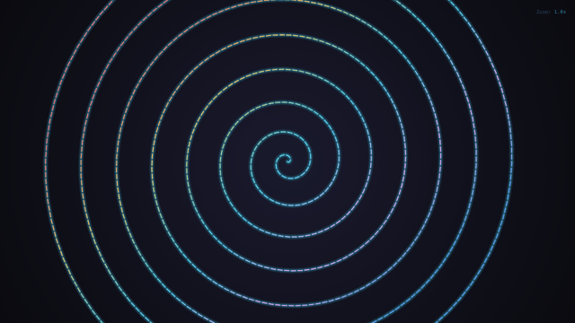
</p>

## Features

- 10 spiral types: Archimedean, Fibonacci, Fermat, Logarithmic, Hyperbolic, Lituus, Theodorus, Vogel, Uzumaki, and Curlicue
- Real-time animation with adjustable speed
- 10 color presets with gradient support
- Line style options: Solid, Dashed, Dotted, Glow, Points, and Triangles
- Theme options: Dark, Black, Gradient, and Matching backgrounds
- Curated presets for interesting spiral configurations
- Pan and zoom controls
- Export to PNG
- Shareable URLs with encoded parameters
- Keyboard shortcuts for quick control
- Progressive Web App (PWA) support

## Showcase

<table>
  <tr>
    <td align="center">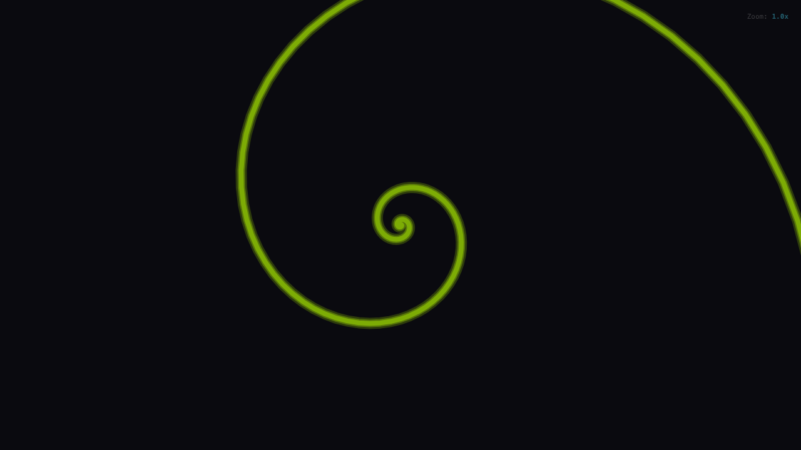<br><strong>Golden Spiral</strong></td>
    <td align="center">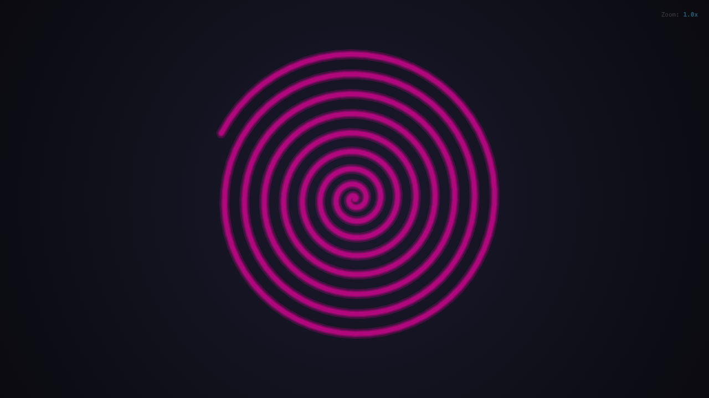<br><strong>Uzumaki Chaos</strong></td>
  </tr>
  <tr>
    <td align="center">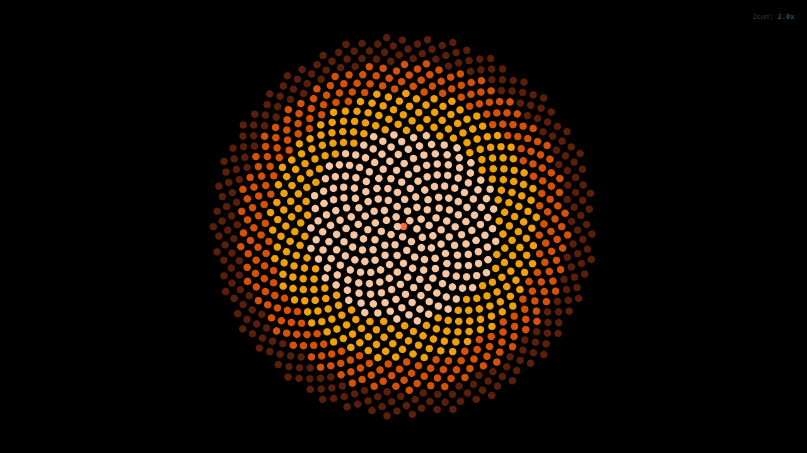<br><strong>Sunflower (Vogel)</strong></td>
    <td align="center">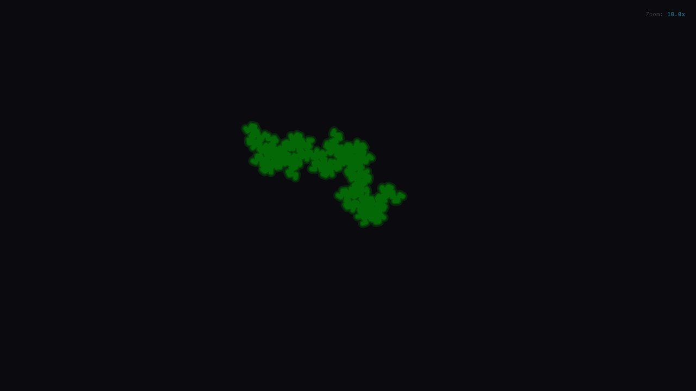<br><strong>Curlicue Fractal</strong></td>
  </tr>
  <tr>
    <td align="center">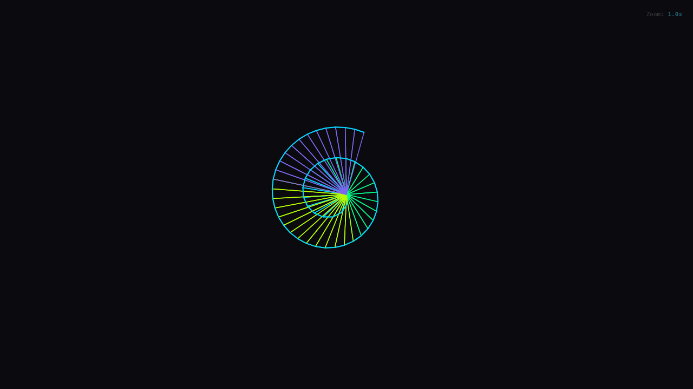<br><strong>Wheel of Theodorus</strong></td>
    <td align="center">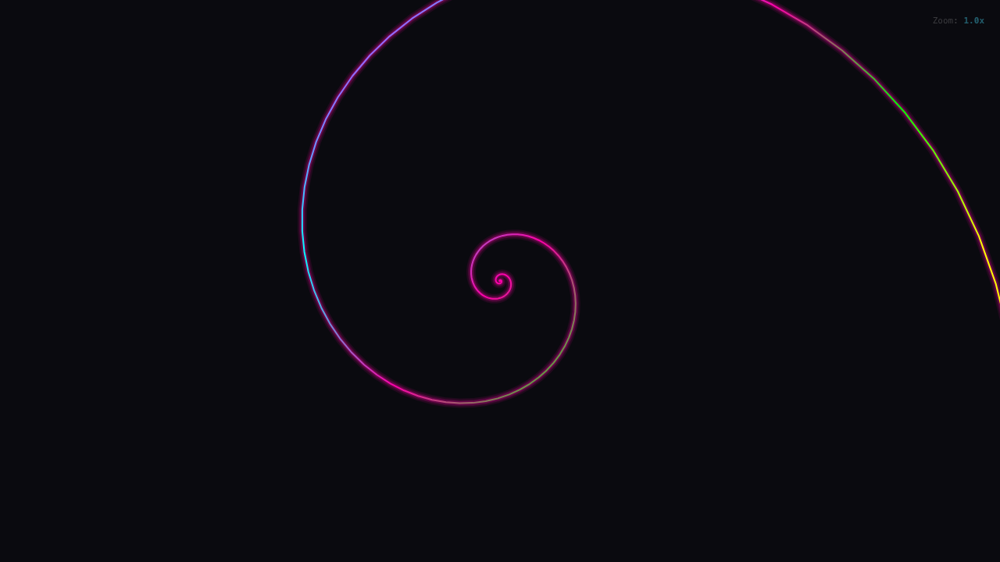<br><strong>Neon Colors</strong></td>
  </tr>
</table>

## Spiral Mathematics

Each spiral type follows a specific mathematical formula. Most use polar coordinates where `r` is the radius and `theta` is the angle.

### Mathematical Constants

| Constant | Symbol | Value | Description |
| -------- | ------ | ----- | ----------- |
| Golden Ratio | phi | (1 + sqrt(5)) / 2 | Approximately 1.618 |
| Golden Angle | - | 137.5 degrees | 360 / phi^2, optimal packing angle |
| Euler's Number | e | 2.71828... | Base of natural logarithm |

### Polar Coordinate Spirals

<table>
  <tr>
    <td align="center" width="50%">
      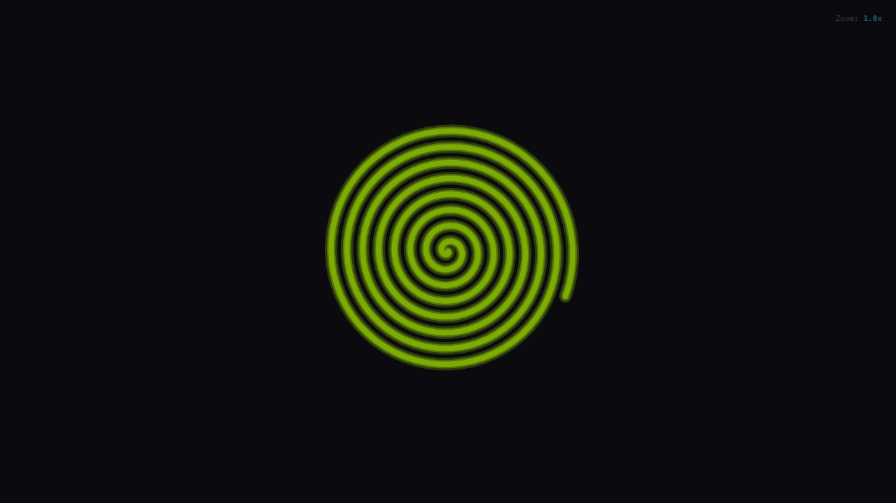<br>
      <strong>Archimedean Spiral</strong><br>
      <code>r = a + b * theta</code><br>
      <em>Constant spacing between turns. Named after Archimedes who first described it circa 225 BC.</em>
    </td>
    <td align="center" width="50%">
      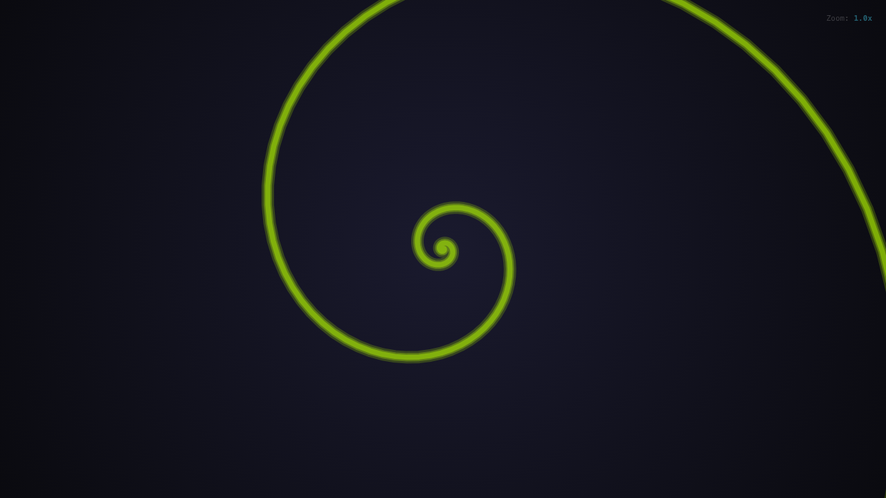<br>
      <strong>Fibonacci (Golden) Spiral</strong><br>
      <code>r = a * phi^(2 * theta / pi)</code><br>
      <em>Self-similar spiral based on the golden ratio. Found in nautilus shells and galaxies.</em>
    </td>
  </tr>
  <tr>
    <td align="center">
      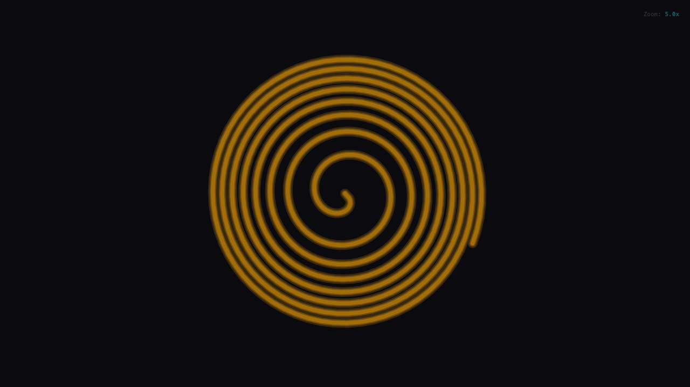<br>
      <strong>Fermat Spiral</strong><br>
      <code>r = a * sqrt(theta)</code><br>
      <em>Parabolic spiral where area swept is proportional to angle. Used in optics.</em>
    </td>
    <td align="center">
      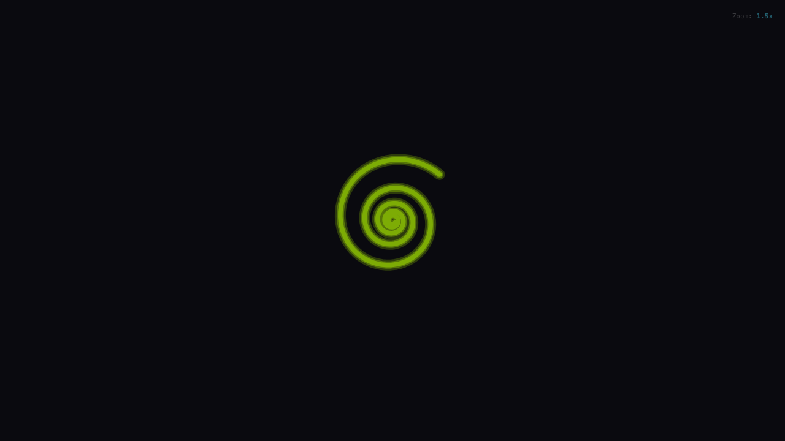<br>
      <strong>Logarithmic Spiral</strong><br>
      <code>r = a * e^(b * theta)</code><br>
      <em>Self-similar at any scale. Also called equiangular spiral. Seen in hurricanes.</em>
    </td>
  </tr>
  <tr>
    <td align="center">
      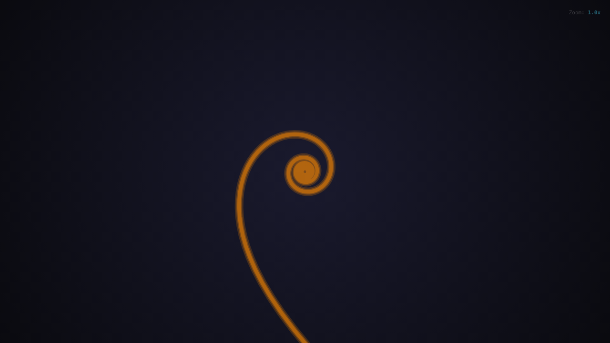<br>
      <strong>Hyperbolic Spiral</strong><br>
      <code>r = a / theta</code><br>
      <em>Approaches a point asymptotically. The inverse of the Archimedean spiral.</em>
    </td>
    <td align="center">
      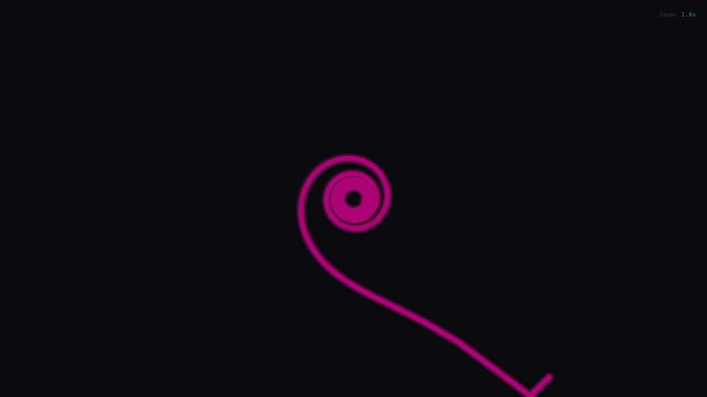<br>
      <strong>Lituus Spiral</strong><br>
      <code>r = a / sqrt(theta)</code><br>
      <em>Named for its trumpet-like shape (lituus = Roman curved trumpet).</em>
    </td>
  </tr>
</table>

### Special Construction Spirals

<table>
  <tr>
    <td align="center" width="50%">
      <br>
      <strong>Spiral of Theodorus</strong><br>
      <code>angle_n = sum(arctan(1 / sqrt(k))) for k=1..n</code><br>
      <em>Constructed from right triangles with hypotenuse sqrt(n). Demonstrates irrationality of square roots.</em>
    </td>
    <td align="center" width="50%">
      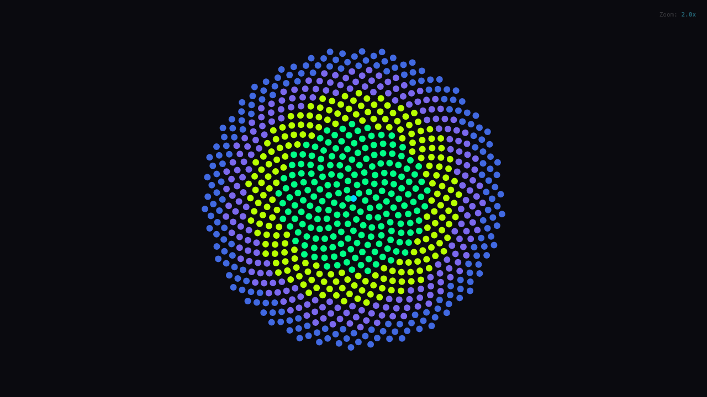<br>
      <strong>Vogel Spiral (Phyllotaxis)</strong><br>
      <code>theta_n = n * 137.5 deg, r_n = c * sqrt(n)</code><br>
      <em>Models sunflower seed arrangement. Uses golden angle for optimal packing.</em>
    </td>
  </tr>
  <tr>
    <td align="center">
      <br>
      <strong>Curlicue Fractal</strong><br>
      <code>phi_n = 2 * pi * s * n^2</code><br>
      <em>Where s is irrational (phi). Cumulative angle sums create fractal patterns.</em>
    </td>
    <td align="center">
      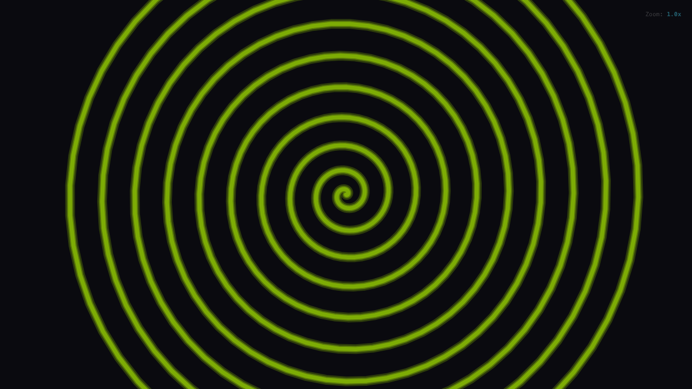<br>
      <strong>Uzumaki Spiral</strong><br>
      <code>Custom chaotic formula</code><br>
      <em>Inspired by the manga. Time-varying amplitude with sinusoidal modulation.</em>
    </td>
  </tr>
</table>

### Spirals in Nature

| Spiral Type | Natural Examples |
| ----------- | ---------------- |
| Fibonacci / Logarithmic | Nautilus shells, galaxy arms, hurricane formations |
| Vogel / Fermat | Sunflower seeds, pinecones, flower petals |
| Archimedean | Watch springs, rolled paper, coiled ropes |
| Theodorus | Mathematical construction, no direct natural analog |

## Getting Started

### Web App

#### Prerequisites

- Node.js 18+
- npm or yarn

#### Installation

```bash
cd web
npm install
```

#### Development

```bash
npm run dev
```

#### Build

```bash
npm run build
```

#### Preview Production Build

```bash
npm run preview
```

### Apple App (iOS / macOS)

A native SwiftUI implementation with the same features as the web app.

#### Prerequisites

- macOS 14.0+
- Xcode 16+ (for development)
- Swift 6.0+

#### Build and Run

Using Swift Package Manager:

```bash
cd apple
swift build
swift run Uzumaki
```

Or open in Xcode:

```bash
cd apple
open Package.swift
```

Then select the `Uzumaki` scheme and run (Cmd+R).

#### Run Tests

```bash
cd apple
swift test
```

#### Features

- Native SwiftUI Canvas rendering
- SIMD-optimized spiral generation
- All 8 spiral types from the web app
- All 10 color presets
- Play/pause animation with TimelineView
- Pinch-to-zoom and pan gestures
- PNG export
- Keyboard shortcuts (Space, R, E)
- macOS menu bar integration

## Keyboard Shortcuts

| Key              | Action               |
| ---------------- | -------------------- |
| Space            | Play/Pause animation |
| R                | Reset to defaults    |
| E                | Export as PNG        |
| F                | Toggle fullscreen    |
| Arrow Up/Down    | Adjust speed         |
| Arrow Left/Right | Adjust tightness     |
| 1-7              | Switch spiral type   |

## Tech Stack

### Web

- React 19
- TypeScript
- Vite
- Canvas API

### Apple

- Swift 6
- SwiftUI
- Swift Package Manager
- SIMD for optimized math

## License

MIT

---

Made with ❤️ by [Cameron Rye](https://rye.dev)